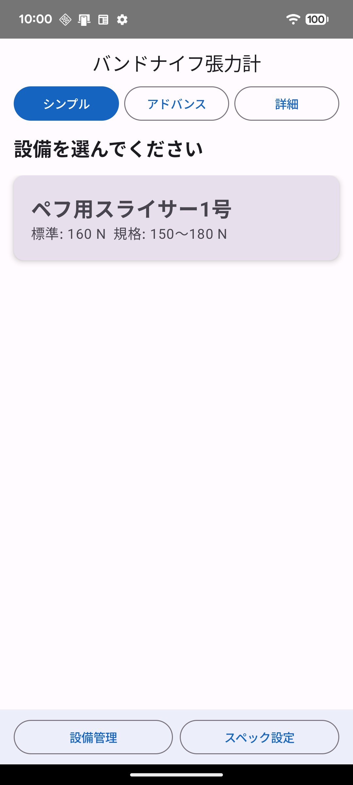
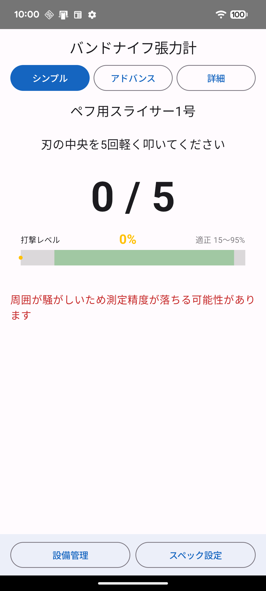
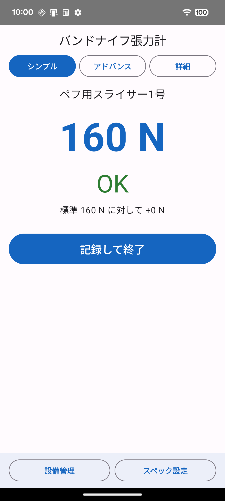
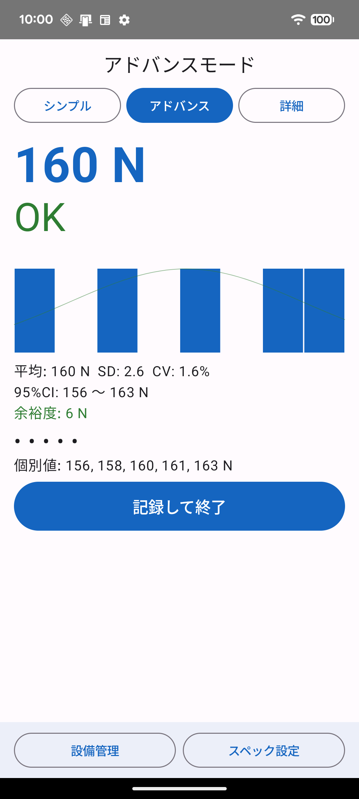
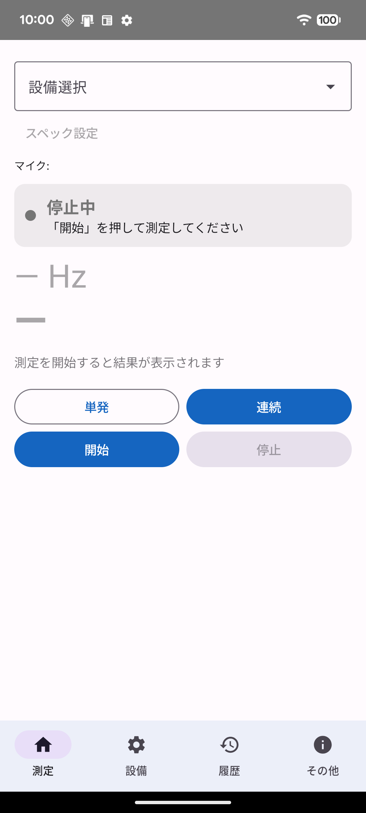
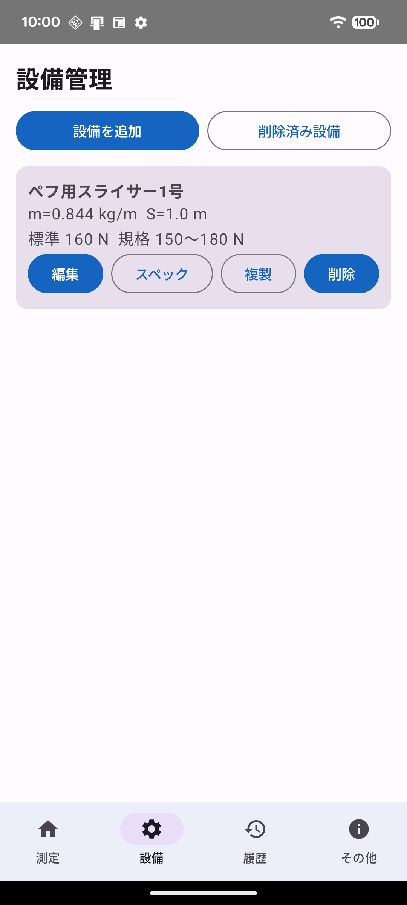
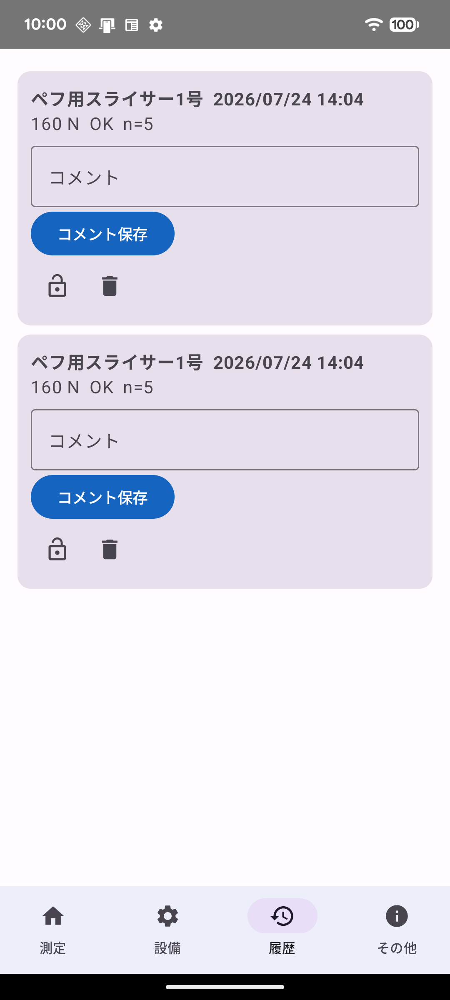
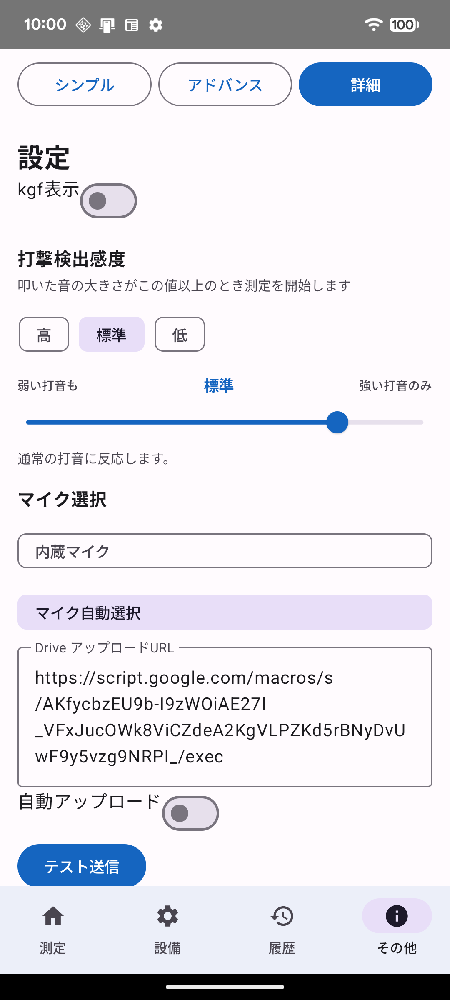
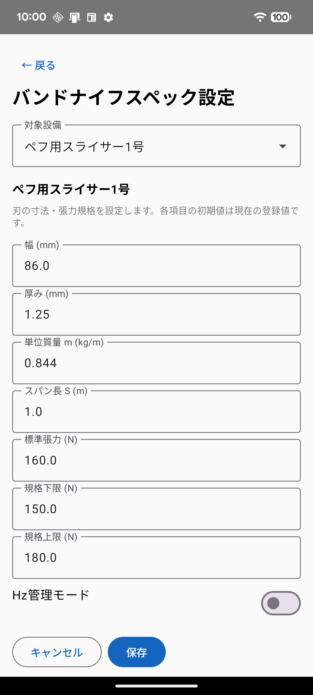
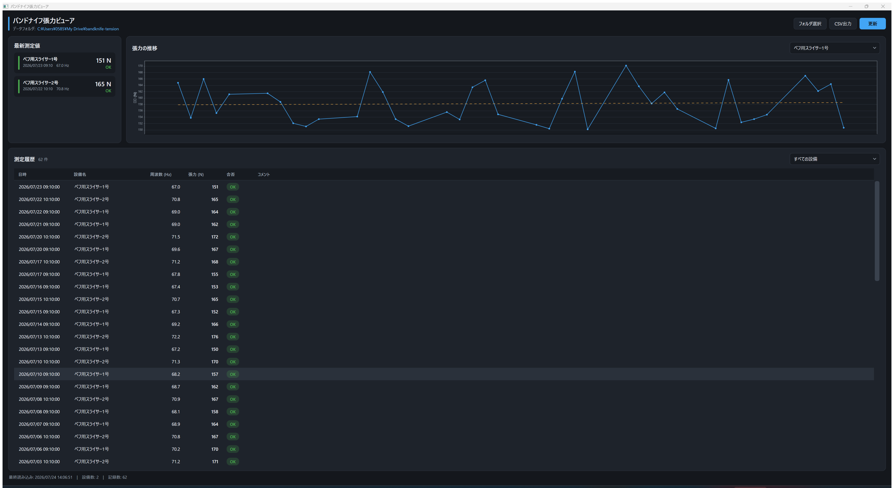

---
pdf_options:
  format: A4
  margin: 20mm 16mm 22mm 16mm
  printBackground: true
  displayHeaderFooter: true
  headerTemplate: |-
    <style>section { margin: 0 auto; font-family: "Yu Gothic UI", "Meiryo", sans-serif; font-size: 8px; color: #888; }</style>
    <section>バンドナイフ張力測定システム 操作マニュアル</section>
  footerTemplate: |-
    <section style="margin: 0 auto; font-family: 'Yu Gothic UI', 'Meiryo', sans-serif; font-size: 8px; color: #888;">
      <span class="pageNumber"></span> / <span class="totalPages"></span>
    </section>
css: |-
  body, .markdown-body { font-family: "Yu Gothic UI", "Meiryo", "Hiragino Sans", sans-serif; font-size: 10.5pt; line-height: 1.75; color: #1a1a2e; padding: 0 !important; max-width: none !important; }
  h1 { font-size: 21pt; border-bottom: 3px solid #1565c0; padding-bottom: 8px; color: #0d47a1; }
  h2 { font-size: 15pt; color: #0d47a1; border-left: 6px solid #1565c0; padding-left: 10px; margin-top: 0.6em; page-break-before: always; page-break-after: avoid; }
  h3 { font-size: 12pt; color: #1565c0; margin-top: 1.8em; page-break-after: avoid; }
  table { border-collapse: collapse; width: 100%; font-size: 9.5pt; page-break-inside: avoid; }
  tr { page-break-inside: avoid; }
  th { background: #e3f0fb; color: #0d47a1; }
  th, td { border: 1px solid #b9cfe4; padding: 5px 9px; }
  code { background: #eef2f7; padding: 1px 5px; border-radius: 3px; font-size: 9pt; }
  blockquote { border-left: 4px solid #ff9800; background: #fff8ec; padding: 8px 14px; margin-left: 0; }
  figure { margin: 10px 0; text-align: center; page-break-inside: avoid; }
  figure img { border: 1px solid #ccd6e0; border-radius: 10px; box-shadow: 0 2px 6px rgba(0,0,0,.12); }
  figcaption { font-size: 9pt; color: #555; margin-top: 6px; }
  table.side { display: table; width: 100%; border-collapse: collapse; page-break-inside: avoid; margin: 10px 0; }
  table.side > tbody > tr, table.side > tbody > tr > td { border: none; background: none; }
  table.side > tbody > tr > td { vertical-align: top; padding: 0 8px 0 0; }
  table.side td.side-img { width: 236px; text-align: center; padding: 0 14px 0 0; }
  table.side td.side-img img { border: 1px solid #ccd6e0; border-radius: 10px; box-shadow: 0 2px 6px rgba(0,0,0,.12); }
  table.side .cap { display: block; font-size: 9pt; color: #555; margin-top: 5px; }
  table.inner { display: table; width: 100%; border-collapse: collapse; font-size: 9.5pt; margin: 0 0 8px; }
  table.inner th { background: #e3f0fb; color: #0d47a1; border: 1px solid #b9cfe4; padding: 5px 9px; text-align: left; }
  table.inner td { border: 1px solid #b9cfe4; padding: 5px 9px; background: #fff; }
  table.side ul { margin: 0 0 8px 1em; padding-left: 1em; font-size: 10pt; }
  table.side p { font-size: 10pt; margin: 0 0 8px; }
  table.figs { display: table; width: auto; margin: 14px auto; page-break-inside: avoid; }
  table.figs tr, table.figs td { border: none; background: none; }
  table.figs td { padding: 2px 8px; text-align: center; vertical-align: top; }
  table.figs img { border: 1px solid #ccd6e0; border-radius: 10px; box-shadow: 0 2px 6px rgba(0,0,0,.12); }
  table.figs .cap { font-size: 9pt; color: #555; }
  .page-break { page-break-after: always; }
  .cover { text-align: center; margin-top: 90px; }
  .cover h1 { border: none; font-size: 27pt; }
  .cover .sub { font-size: 13pt; color: #455a64; margin-top: 4px; }
  .cover .meta { margin-top: 70px; font-size: 10.5pt; color: #455a64; }
  .promo-catch { font-size: 23pt; font-weight: bold; color: #0d47a1; text-align: center; line-height: 1.45; margin: 18px 0 6px; }
  .promo-lead { text-align: center; font-size: 11pt; color: #37474f; margin: 0 30px 10px; }
  table.promo { display: table; width: 100%; border-collapse: separate; border-spacing: 8px; margin: 4px 0; }
  table.promo tr { background: none; border: none; }
  table.promo td { border: none; background: #eaf3fc; border-radius: 12px; padding: 12px 14px; width: 33.3%; vertical-align: top; font-size: 9.5pt; line-height: 1.55; }
  table.promo .pt { display: block; font-size: 11.5pt; font-weight: bold; color: #0d47a1; margin-bottom: 4px; }
  table.promo.stats td { background: #0d47a1; color: #fff; text-align: center; padding: 10px 6px; }
  table.promo.stats .num { display: block; font-size: 20pt; font-weight: bold; line-height: 1.2; }
  table.promo.stats .unit { font-size: 9pt; opacity: .85; }
  .promo-flow { text-align: center; background: #fff3e0; border-radius: 12px; padding: 10px 14px; font-size: 10.5pt; color: #5d4037; margin-top: 8px; }
---

<div class="cover">

# バンドナイフ張力測定システム<br>操作マニュアル

<p class="sub">スマートフォンで刃を叩いて張力をはかる</p>

<p class="meta">
第2版　2026年7月<br>
対象アプリ: バンドナイフ張力計 v1.0.0（Android）／ バンドナイフ張力ビューア（Windows）
</p>

</div>

<div class="page-break"></div>

<p class="promo-catch">叩いて、はかる。<br>スマホ1台で、刃の張力管理を。</p>

<p class="promo-lead">専用の張力計はもういりません。バンドナイフを軽く5回叩くだけで、音から張力を自動計算。誰が測っても、同じ結果。</p>

<table class="promo stats">
<tr>
<td><span class="num">約1分</span><span class="unit">1回の測定にかかる時間</span></td>
<td><span class="num">5回</span><span class="unit">叩くだけの簡単操作</span></td>
<td><span class="num">0円</span><span class="unit">追加の測定器・専用ハード</span></td>
</tr>
</table>

<table class="promo">
<tr>
<td><span class="pt">測るのは、いつものスマホ</span>マイクで打撃音を拾い、固有振動数から張力を自動計算。工具箱に測定器を増やす必要はありません。</td>
<td><span class="pt">その場で合否がわかる</span>設備ごとに登録した規格範囲と比べて、<b>OK / 要調整</b> を大きな文字で即表示。判断に迷いません。</td>
<td><span class="pt">人による差が出ない</span>張力計の当て方や読み取りのクセとは無縁。叩く位置さえ守れば、新人もベテランも同じ値になります。</td>
</tr>
<tr>
<td><span class="pt">記録は自動でクラウドへ</span>測定したそばから Google ドライブに自動保存。転記ミスも、記録のつけ忘れもなくなります。</td>
<td><span class="pt">事務所のPCで推移がみえる</span>付属の Windows ビューアで、設備ごとの張力推移をグラフ表示。刃の劣化傾向や調整時期がひと目でわかります。</td>
<td><span class="pt">使う人に合わせた3モード</span>現場向けの「シンプル」、品質管理向けの「アドバンス」、管理者向けの「詳細」。必要な情報だけを表示します。</td>
</tr>
<tr>
<td><span class="pt">ミスした打撃は自動で除外</span>二重打撃・弱すぎる打撃・倍音のかぶりを品質チェックで検出。有効な打撃だけを集計します。</td>
<td><span class="pt">騒がしい工場でも</span>打撃検出感度は3段階＋微調整に対応。外付けピンマイクにも切り替えられます。</td>
<td><span class="pt">設備は何台でも登録可能</span>刃の寸法・スパン長・規格範囲を設備ごとに保存。複製機能で同型機の追加も一瞬です。</td>
</tr>
</table>

<p class="promo-flow"><b>現場で叩く → クラウドに自動記録 → 事務所で推移を確認。</b><br>張力管理の一連の流れが、このシステムひとつで完結します。</p>


## 目次

1. [このシステムでできること](#1-このシステムでできること)
2. [毎日の測定はこれだけ（クイックスタート）](#2-毎日の測定はこれだけクイックスタート)
3. [インストール（Android）](#3-インストールandroid)
4. [シンプルモード — 日常の定期測定](#4-シンプルモード--日常の定期測定)
5. [アドバンスモード — ばらつきの確認](#5-アドバンスモード--ばらつきの確認)
6. [詳細モード — 管理者向け機能](#6-詳細モード--管理者向け機能)
7. [設備の登録とスペック設定](#7-設備の登録とスペック設定)
8. [正しい叩き方と測定のコツ](#8-正しい叩き方と測定のコツ)
9. [Google ドライブ連携](#9-google-ドライブ連携)
10. [Windows 閲覧ソフト（ビューア）](#10-windows-閲覧ソフトビューア)
11. [こんなときは（トラブルシューティング）](#11-こんなときはトラブルシューティング)
- [付録A: 測定の原理](#付録a-測定の原理)
- [付録B: マニュアル画像の再生成（開発者向け）](#付録b-マニュアル画像の再生成開発者向け)


## 1. このシステムでできること

バンドナイフ（帯刃）のスパン中央を軽く叩き、その音をスマートフォンのマイクで拾って固有振動数を検出し、刃の張力（N）を自動計算するシステムです。専用の張力計を使わずに、日常点検として誰でも同じ方法で張力を管理できます。

### システム構成

| 成果物 | 役割 |
|--------|------|
| `バンドナイフ張力計.apk` | Android 測定アプリ。叩いた音から張力を算出し、合否判定・記録を行う |
| `drive-upload.gs` | Google Apps Script。測定記録を Google ドライブへ自動保存する |
| `バンドナイフ張力ビューア.exe` | Windows 閲覧ソフト。PC で履歴一覧と推移グラフを表示する |

**測定（スマホ）→ 自動アップロード（Google ドライブ）→ 閲覧・分析（PC）** という流れで、現場の測定値が自動的に事務所の PC から確認できるようになります。

### 3つの操作モード

アプリは利用者に合わせて 3 つのモードを切り替えられます（画面上部のボタン、または詳細モードの「その他」タブ）。

| モード | 想定ユーザー | 特徴 |
|--------|-------------|------|
| **シンプル** | 現場作業者 | 設備を選んで 5 回叩くだけ。結果は大きな数字と OK / 要調整 のみ |
| **アドバンス** | 品質管理担当 | シンプルと同じ操作で、ヒストグラム・統計量（SD・CV・信頼区間）も表示 |
| **詳細** | 管理者 | 単発/連続測定、設備管理、履歴管理、感度・マイク・連携などの全設定 |


## 2. 毎日の測定はこれだけ（クイックスタート）

日常点検は次の 4 ステップで完了します。所要時間は 1 分程度です。

> **測定前に必ず機械を停止してください。**

| ステップ | 操作 |
|---------|------|
| 1 | アプリを起動する（シンプルモードで開きます） |
| 2 | 測定する設備のカードをタップする |
| 3 | 刃のスパン中央を **5 回** 軽く叩く（マイクは刃から 1〜2 cm） |
| 4 | 結果（OK / 要調整）を確認し、**「記録して終了」** をタップする |

<table class="figs">
<tr>
<td></td>
<td></td>
<td></td>
</tr>
<tr>
<td class="cap">図1　設備を選ぶ</td>
<td class="cap">図2　5回叩く</td>
<td class="cap">図3　結果を確認して記録</td>
</tr>
</table>

**要調整** と表示されたら、張力を調整したうえでもう一度測定してください。詳しい操作は次章以降で説明します。


## 3. インストール（Android）

対応 OS: **Android 8.0（API 26）以上**

1. `バンドナイフ張力計.apk` をスマートフォンにコピーします（USB ケーブル、共有ドライブなど）。
2. スマートフォンの **設定 → セキュリティ** で「提供元不明のアプリのインストール」を許可します。
3. ファイルアプリで APK をタップし、インストールします。
4. 初回起動時に **使用者の登録** 画面が出ます（次項）。
5. 続いて表示される **マイクの使用許可** で「許可」を選びます。

> マイク権限は測定に必須です。誤って拒否した場合は、Android の **設定 → アプリ → バンドナイフ張力計 → 権限** から許可し直してください。

### 初回起動時の使用者登録

設備の規格値を誰が変更したのかを記録に残すため、はじめに **名前とパスワード** を設定します。

| 状況 | 選ぶもの | 操作 |
|------|---------|------|
| はじめて使う人 | **新しく登録** | 名前とパスワード（6 文字以上）を入力 |
| 別の端末で登録済みの人 | **登録済みの使用者** | 同じ名前とパスワードでサインイン |

- パスワードは端末内に暗号化して保存されるので、**2 回目以降は入力不要** です。
- 管理者が **登録キー** を設定している場合は、新規登録のときだけ登録キーの入力が必要です。管理者に確認してください。
- 名前とパスワードは、あとから **その他 → 使用者 → 名前・パスワードを変更** で変えられます。
- 測定するだけなら登録は必須ではありません（**あとで設定** を選べます）。設備の追加・変更をするときに求められます。

> 端末を初期化したりアプリを入れ直したりすると、保存された情報は消えます。同じ名前とパスワードでサインインし直してください。パスワードを忘れた場合は管理者に連絡してください。

## 4. シンプルモード — 日常の定期測定

アプリ起動時の既定モードです。迷う要素をなくした、現場での定例チェック専用の画面です。

### ステップ1: 設備を選ぶ

登録済みの設備がカードで一覧表示されます。カードには **標準張力** と **規格範囲** が表示されているので、測定対象をタップしてください。

<table class="side">
<tr>
<td class="side-img">

<span class="cap">図1（再掲）　設備選択画面</span>
</td>
<td>
<table class="inner">
<tr><th>画面下部のボタン</th><th>機能</th></tr>
<tr><td>設備管理</td><td>設備の追加・編集・複製・削除</td></tr>
<tr><td>スペック設定</td><td>選択中設備の寸法・張力規格の変更（7章参照）</td></tr>
</table>
<p>カードをタップした時点で測定待機に入ります。誤って選んだ場合は画面上部のモード切替ボタンでいったん戻れます。</p>
</td>
</tr>
</table>

### ステップ2: 刃を5回叩く

設備を選ぶと自動的に測定待機になります。「刃の中央を5回軽く叩いてください」と表示されたら測定開始です。

1. マイク（スマホ下部）を刃から **1〜2 cm** 離して構えます。
2. **スパン（自由振動区間）の中央** をプラスチックの柄や指の腹で軽く叩きます。
3. 叩くたびにカウンター（`1 / 5` → `2 / 5` …）が進みます。

<table class="side">
<tr>
<td class="side-img">

<span class="cap">図2（再掲）　測定中の画面</span>
</td>
<td>
<table class="inner">
<tr><th>画面の表示</th><th>意味</th></tr>
<tr><td>カウンター n / 5</td><td>有効と判定された打撃の回数</td></tr>
<tr><td>打撃レベル</td><td>叩いた強さ。適正範囲は 15〜95%。バーが範囲内に収まるように叩く</td></tr>
<tr><td>赤色の警告</td><td>「周囲が騒がしいため…」など。測定精度に影響する状況の注意喚起</td></tr>
</table>
<p>うまくカウントされないときは 8 章「正しい叩き方と測定のコツ」を参照してください。</p>
</td>
</tr>
</table>

### ステップ3: 結果を確認して記録する

5 回の測定が完了すると、自動的に結果画面に切り替わります。

<table class="side">
<tr>
<td class="side-img">

<span class="cap">図3（再掲）　シンプルモードの結果画面（規格内の例）</span>
</td>
<td>
<table class="inner">
<tr><th>表示</th><th>意味</th></tr>
<tr><td>大きな数字（例: 160 N）</td><td>5 回の測定の平均張力</td></tr>
<tr><td><b>OK</b>（緑）</td><td>規格範囲内。このまま使用できます</td></tr>
<tr><td><b>要調整</b>（赤）</td><td>規格範囲外。張力を調整して再測定してください</td></tr>
<tr><td>標準 160 N に対して +0 N</td><td>標準張力との差</td></tr>
</table>
<p><b>「記録して終了」</b>をタップすると履歴に保存され、設備選択画面に戻ります。自動アップロードが ON の場合は Google ドライブにも送信されます（9 章参照）。</p>
</td>
</tr>
</table>


## 5. アドバンスモード — ばらつきの確認

操作の流れはシンプルモードと同じです（設備を選ぶ → 5 回叩く → 記録）。結果画面に **統計情報とグラフ** が追加されるため、測定のばらつきや刃の状態をより詳しく評価できます。

<table class="side">
<tr>
<td class="side-img">

<span class="cap">図4　アドバンスモードの結果画面</span>
</td>
<td>
<table class="inner">
<tr><th>表示項目</th><th>説明</th></tr>
<tr><td>ヒストグラム</td><td>5 回の測定値の分布。ばらつきが大きいと山が広がる</td></tr>
<tr><td>平均・SD・CV</td><td>平均張力、標準偏差、変動係数。<b>CV が数 % 以内</b>なら安定した測定</td></tr>
<tr><td>95%CI</td><td>平均値の 95% 信頼区間</td></tr>
<tr><td>余裕度</td><td>規格限界までの余裕（N）。緑なら安全側、赤なら規格逸脱</td></tr>
<tr><td>個別値</td><td>5 回それぞれの張力値</td></tr>
</table>
<p>こんなときに使います。</p>
<ul>
<li>定期測定で<b>要調整が出た原因</b>を調べたいとき（1 回だけ外れたのか、全体がずれたのか）</li>
<li>刃の交換直後や張力調整後に、<b>測定が安定しているか</b>確かめたいとき</li>
<li>品質記録として<b>ばらつきも含めて</b>残したいとき</li>
</ul>
</td>
</tr>
</table>

## 6. 詳細モード — 管理者向け機能

画面下部のタブ（**測定 / 設備 / 履歴 / その他**）で全機能にアクセスできます。

### 6-1. 測定タブ

回数を固定しない自由な測定ができます。

<table class="side">
<tr>
<td class="side-img">

<span class="cap">図5　詳細モードの測定タブ</span>
</td>
<td>
<table class="inner">
<tr><th>操作</th><th>説明</th></tr>
<tr><td>設備選択</td><td>ドロップダウンから測定対象を選ぶ</td></tr>
<tr><td>スペック設定</td><td>選択中設備の寸法・規格を直接編集</td></tr>
<tr><td>単発 / 連続</td><td>1 回だけ測定するか、複数回連続で測定するか</td></tr>
<tr><td>開始 / 停止</td><td>測定の開始と中断</td></tr>
</table>
<p>測定中は検出した<b>周波数（Hz）</b>と<b>張力（N）</b>がリアルタイムで表示され、完了後に履歴へ記録できます。</p>
</td>
</tr>
</table>

### 6-2. 設備タブ（設備管理）

<table class="side">
<tr>
<td class="side-img">

<span class="cap">図6　設備管理画面</span>
</td>
<td>
<table class="inner">
<tr><th>ボタン</th><th>機能</th></tr>
<tr><td>設備を追加</td><td>新しい設備を登録する（7 章参照）</td></tr>
<tr><td>削除済み設備</td><td>削除した設備の復元・完全削除</td></tr>
<tr><td>編集 / スペック</td><td>設備情報・寸法規格の変更</td></tr>
<tr><td>複製</td><td>同型機を登録するときに便利なコピー機能</td></tr>
<tr><td>削除</td><td>設備を削除（履歴は残ります）</td></tr>
</table>
</td>
</tr>
</table>

### 6-3. 履歴タブ

過去の測定記録を新しい順に一覧表示します。

<table class="side">
<tr>
<td class="side-img">

<span class="cap">図7　履歴画面</span>
</td>
<td>
<ul>
<li><b>コメント</b> … 「刃交換後の初回測定」などのメモを付けて保存できます</li>
<li><b>ロック（鍵アイコン）</b> … 記録を保護し、誤った編集・削除を防ぎます</li>
<li><b>削除（ゴミ箱アイコン）</b> … 打ち損じなど不要な記録を削除します</li>
</ul>
</td>
</tr>
</table>

### 6-4. その他タブ（設定）

モード切替と各種設定をまとめたタブです。

<table class="side">
<tr>
<td class="side-img">

<span class="cap">図8　設定画面</span>
</td>
<td>
<table class="inner">
<tr><th>設定項目</th><th>説明</th></tr>
<tr><td>kgf 表示</td><td>張力の単位を N から kgf に切り替える</td></tr>
<tr><td>打撃検出感度</td><td>高 / 標準 / 低 の 3 段階＋スライダー微調整。騒音環境では「低」へ</td></tr>
<tr><td>マイク選択</td><td>内蔵マイクと外付けマイクの切り替え（自動選択も可）</td></tr>
<tr><td>Drive アップロード URL</td><td>Google Apps Script のウェブアプリ URL（9 章参照）</td></tr>
<tr><td>自動アップロード</td><td>ON にすると記録のたびに自動送信</td></tr>
<tr><td>テスト送信</td><td>ドライブ連携の疎通確認</td></tr>
</table>
</td>
</tr>
</table>


## 7. 設備の登録とスペック設定

### 設備の設定は全端末で共有されます

設備の規格値は Google ドライブで一元管理します。**ドライブの設備マスターに載っていない設備では測定できません。** 古い規格値のまま合否を出して、不良を良品と判定する事故を防ぐためです。

| 状態 | 画面の表示 | 測定 |
|------|-----------|------|
| ドライブ未登録の設備 | 設備カードに「ドライブ未登録」バッジ、選択できない | その設備のみ不可 |
| 最後の接続確認から 5 日以上 | 「あと N 日で測定できなくなります」 | 可 |
| 最後の接続確認から 7 日以上 | 「測定できません」＋「今すぐ確認」 | すべて不可 |

**7 日ごとに電波の届く場所でアプリを開く** 運用が前提です。手動で確認する場合は **その他 → 設備マスターの共有 → 今すぐ確認** をタップしてください。

### 設備の新規登録

**詳細モード → 設備タブ → 設備を追加**（またはシンプルモード下部の「設備管理」）から登録します。

| 項目 | 説明 | 入力例 |
|------|------|--------|
| 設備名 | 識別用の名前 | ペフ用スライサー1号 |
| 幅 / 厚み（mm） | 刃の断面寸法。単位質量 m の自動計算に使用 | 86 / 1.25 |
| スパン長 S（m） | 自由振動区間（支持点間）の長さ | 1.0 |
| 標準張力（N） | 目標とする張力 | 160 |
| 規格下限 / 上限（N） | OK / 要調整 の判定範囲 | 150 / 180 |

### スペック設定画面

登録済み設備の寸法・規格は、スペック設定画面でいつでも変更できます。

<table class="side">
<tr>
<td class="side-img">

<span class="cap">図9　スペック設定画面</span>
</td>
<td>
<ul>
<li>幅・厚みを変更すると<b>単位質量 m（kg/m）が自動再計算</b>されます</li>
<li><b>Hz 管理モード</b>を ON にすると、張力（N）ではなく周波数（Hz）の範囲で合否判定できます</li>
<li>変更は<b>保存</b>をタップした時点で反映されます</li>
</ul>
<p>スパン長 S は計算結果に 2 乗で効きます（付録 A 参照）。<b>支持点間の実寸を正確に</b>入力してください。</p>
</td>
</tr>
</table>

> 設備の追加・変更・削除には **使用者のサインインが必要** です。未設定の場合は画面にその案内が出るので、そこから登録してください（3 章参照）。

### 変更を全端末へ反映する

端末で設備を変更しただけでは、他の端末には反映されません。**その設備は、ドライブへ登録し直すまで測定に使えなくなります。**

1. 設備を追加・変更する
2. **その他 → 設備マスターの共有 → ドライブへ登録** をタップ
3. 確認画面の内容（更新者名・件数）を見て実行する

| 出たメッセージ | 意味と対処 |
|---------------|-----------|
| 「〜件の設備が全端末から消えます」 | 消える設備名を確認し、問題なければもう一度実行する |
| 「他の人が先に設備マスターを更新しました」 | **今すぐ確認** で取り込み直してから、変更をやり直す |
| 「規格が正しくありません」 | 規格の下限・上限、単位質量、スパン長を見直す |

各端末は、アプリ起動時に自動で最新の設備マスターを取り込みます。

### 誰がいつ変更したかを確認する

**その他 → 設備マスターの更新履歴 → 履歴を読み込む** で、世代（第 N 版）ごとの更新者・日時・変更内容の一覧が見られます。ドライブ側では、スプレッドシートの **「設備マスター履歴」** シートで同じ内容を確認できます。

## 8. 正しい叩き方と測定のコツ

測定精度は「叩き方」でほぼ決まります。次の表を目安にしてください。

| 項目 | 推奨 ○ | 避ける × |
|------|--------|---------|
| 道具 | プラスチックの柄、指の腹 | 金属ハンマー（高調波で誤検出しやすい） |
| 叩く位置 | スパンの中央 | 端・支持点（プーリー）付近 |
| 強さ | 軽く「ポン」と弾く。打撃レベル 15〜95% | 強打・こすり付け |
| 間隔 | 1 回ずつはっきり間を空ける | 連打（二重打撃と判定される） |
| マイク | 刃から 1〜2 cm | 刃に接触させる／遠すぎる |

### 安全上の注意

> **必ず機械を停止し、刃が完全に止まってから測定してください。**

### 画面メッセージへの対処

| メッセージ | 対処 |
|-----------|------|
| 打撃が弱すぎます | もう少し強く叩く。改善しなければ感度を「高」へ |
| 打撃が強すぎます | 叩く力を弱める |
| 周囲が騒がしいため測定精度が落ちる可能性があります | 周囲の機械を止める・静かな時間帯に測る・感度を「低」へ |
| 二重打撃を検出 | 1 回ずつ間隔を空けて叩き直す |

騒音の大きい工場では、**有線ピンマイク** を刃の近くに固定する方法も有効です（設定 → マイク選択）。


## 9. Google ドライブ連携

測定記録を Google ドライブへ自動保存すると、事務所の PC からリアルタイムに履歴を確認できます。

### 仕組み

```
スマホ（測定・記録・設備設定）
   │  自動アップロード / 設備マスターの取り込み（HTTPS）
   ▼
Google Apps Script（drive-upload.gs）
   │  追記・更新
   ▼
マイドライブ/バンドナイフ張力測定/
   ├─ 測定記録スプレッドシート（記録・設備マスター・履歴・使用者）
   ├─ records.csv           ←  Windows ビューアが読む
   ├─ equipment.json        ←  設備マスター（全端末の正データ）
   ├─ equipment-history.json ← 更新履歴
   └─ users.json            ←  使用者一覧
```

### セットアップ手順（初回のみ・管理者）

1. [script.google.com](https://script.google.com) で新規プロジェクトを作り、`drive-upload.gs` の内容を貼り付けます。
2. **デプロイ → 新しいデプロイ → ウェブアプリ** を選び、「全員がアクセス可能」でデプロイして URL をコピーします。
3. アプリの **詳細モード → その他 → Drive アップロード URL** に URL を貼り付けます。
4. **自動アップロード** を ON にし、**テスト送信** で「成功」と表示されることを確認します。

初回実行時、マイドライブに **「バンドナイフ張力測定」** フォルダが自動作成されます。ネットワーク圏外で測定した記録は端末に蓄積され、次回接続時にまとめて再送されます。

> 既に古いスクリプトで運用している場合も、`drive-upload.gs` を貼り直して **再デプロイ** してください。古いままだと「ドライブのスクリプトが最新ではありません」と表示され、設備マスターと使用者管理が使えません。

### 使用者登録を絞る（推奨・管理者）

ウェブアプリの URL を知っている人は、既定では誰でも使用者登録でき、設備の規格値を書き換えられます。Apps Script の **プロジェクトの設定 → スクリプト プロパティ** に次を追加すると、登録に合言葉が必要になります。

| プロパティ | 値 |
|-----------|-----|
| `REGISTRATION_KEY` | 管理者だけが知る任意の文字列 |

設定した文字列を、新しく使う人に伝えてください。登録済みの人のサインインには影響しません。

### 設備マスターと使用者の管理場所

| ファイル / シート | 内容 |
|------------------|------|
| `equipment.json` / 「設備マスター」シート | 現在の設備設定。**手で編集しないでください**（失うと全端末が測定不能になります） |
| `equipment-history.json` / 「設備マスター履歴」シート | 誰がいつ何を変えたか |
| `users.json` / 「使用者」シート | 登録済みの使用者。パスワードそのものは保存されません |

## 10. Windows 閲覧ソフト（ビューア）

PC で測定履歴の一覧・推移グラフ・CSV 出力ができるアプリケーションです。ランタイムのインストールは不要で、`バンドナイフ張力ビューア.exe` 単体で動作します。

<figure>

<figcaption>図10　Windows ビューアのメイン画面</figcaption>
</figure>

### セットアップ

1. PC に **Google Drive for Desktop** をインストールし、マイドライブを同期します。
2. `バンドナイフ張力ビューア.exe` をダブルクリックして起動します。
3. データフォルダ（`マイドライブ\バンドナイフ張力測定`）は自動検出されます。見つからない場合は **「フォルダ選択」** で `records.csv` のあるフォルダを指定してください。

### 画面の見かた

| エリア | 内容 |
|--------|------|
| 最新測定値（左上） | 設備ごとの最新の張力・合否・測定日時 |
| 張力の推移（右上） | 時系列グラフ。右上のドロップダウンで設備を切替。破線は標準張力 |
| 測定履歴（下） | 全記録のテーブル。設備での絞り込みが可能。NG 行は色付き表示 |

### ツールバー

| ボタン | 機能 |
|--------|------|
| フォルダ選択 | データフォルダを手動で指定する |
| CSV 出力 | 表示中のデータを CSV ファイルとして保存する（Excel での分析用） |
| 更新 | 最新のデータを読み込み直す |


## 11. こんなときは（トラブルシューティング）

| 症状 | 確認すること |
|------|-------------|
| 叩いてもカウントが進まない | マイク権限が許可されているか／打撃レベルが 15% 以上あるか／感度を「高」にする |
| 測定が始まらない | 設備を選択したか／マイクを他のアプリが使用していないか |
| 張力の値がばらつく | 叩く位置がスパン中央か／金属で叩いていないか／周囲の騒音 |
| 値が明らかにおかしい | スペック設定の幅・厚み・スパン長が実寸どおりか（7 章） |
| 設備が一覧に出ない | 設備管理で登録済みか／「削除済み設備」に入っていないか |
| 設備が選べず「ドライブ未登録」と出る | 管理者が **その他 → 設備マスターの共有 → ドライブへ登録** を実行したか（7 章） |
| 「測定できません」と出て何も測れない | 電波の届く場所で **その他 → 設備マスターの共有 → 今すぐ確認** をタップする（7 章） |
| 設備を編集しようとするとサインインを求められる | 名前とパスワードを設定する（3 章）。忘れた場合は管理者に連絡 |
| 「〜は登録されていません」と出る | 別の端末で名前を変更した可能性があります。新しい名前でサインインし直してください |
| 「ドライブのスクリプトが最新ではありません」 | 管理者が `drive-upload.gs` を貼り直して再デプロイする（9 章） |
| ドライブに記録が上がらない | アップロード URL の設定／自動アップロード ON／ネットワーク接続／「テスト送信」の結果 |
| PC のビューアにデータが出ない | Google Drive for Desktop の同期が完了しているか／フォルダ内に `records.csv` があるか |
| ビューアのグラフが更新されない | 「更新」ボタンを押す／スマホ側のアップロードが完了しているか |

解決しない場合は、システム管理者へ「症状・設備名・測定日時・画面の写真」を添えて連絡してください。

## 付録A: 測定の原理

弦（両端固定の張られた部材）の固有振動数と張力の関係式を利用しています。

<p style="text-align:center; font-size: 14pt;"><strong><em>T</em> = <em>m</em> · ((2π<em>f</em>)² − (nπ/<em>S</em>)⁴·<em>EI</em>/<em>m</em>) / (nπ/<em>S</em>)²</strong></p>
<p>幅・厚み・材種から <em>EI</em> = <em>E</em>·<em>I</em> を求めます。未設定時は旧式 <em>T</em> = 4·<em>m</em>·<em>S</em>²·<em>f</em>² にフォールバックします。</p>

| 記号 | 意味 | 備考 |
|------|------|------|
| *T* | 張力（N） | 求めたい値 |
| *m* | 単位長さあたりの質量（kg/m） | 幅 × 厚み × 鋼の密度から自動計算 |
| *S* | スパン長（m） | 支持点間の自由振動区間 |
| *f* | 1 次固有振動数（Hz） | 叩いた音を FFT 解析して検出 |

アプリは打撃音の周波数スペクトルから基本波を特定し、倍音（高調波）や二重打撃を品質チェックで除外したうえで張力を算出しています。

## 付録B: マニュアル画像の再生成（開発者向け）

本マニュアルのスクリーンショットは、以下のスクリプトで自動再生成できます。

```powershell
# Android 実機キャプチャ（USB 接続、10枚すべて自動撮影）
powershell -File docs\capture-manual-screenshots.ps1

# Windows ビューア（サンプルデータ読込＋最大化キャプチャ）
powershell -File docs\capture-windows-viewer.ps1

# PDF 変換
powershell -File docs\export-manual-pdf.ps1

# アプリ内マニュアル（HTML）を assets に組み込み → 要 APK 再ビルド
powershell -File docs\build-app-manual.ps1
```

- 実機キャプチャはステータスバーをデモモード化（時刻 10:00・電池 100%）した状態で撮影します。
- 測定結果画面は `bandknife_manual_mode` 設定（adb からのみ変更可）を有効にしたうえで、ブロードキャストによるタップ注入で生成しています。

---

*本マニュアルは 2026年7月時点のアプリ v1.0.0 に基づいています。*
